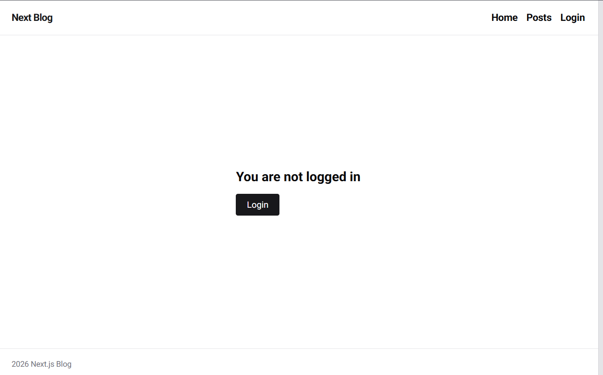
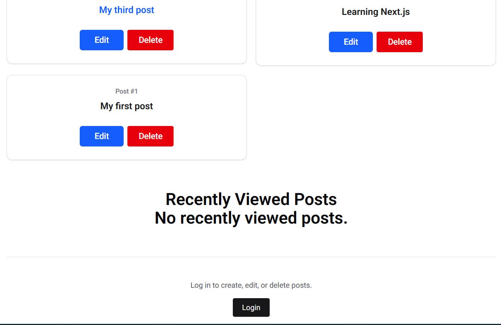
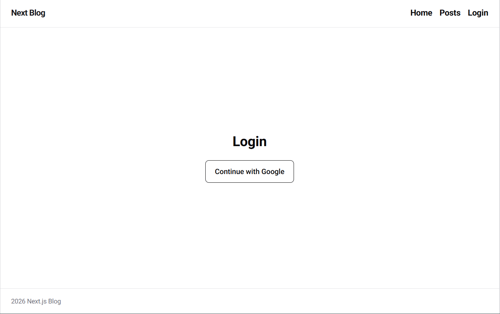

# Next.js Supabase Blog

A full-stack blog application built with Next.js, Supabase, and Tailwind CSS. Visitors can browse posts publicly, while authenticated users can create, edit, and delete posts using Google authentication.

## Features

- Public post browsing
- Google OAuth authentication with Supabase
- Create, edit, and delete posts for authenticated users
- Individual pages for each post
- Recently viewed posts stored with cookies
- Responsive interface built with Tailwind CSS
- Server Components, Server Actions, and Suspense

## Screenshots

### Home page



### Posts page



### Login page



## Technologies

- Next.js
- React
- JavaScript
- Tailwind CSS
- Supabase Database
- Supabase Authentication
- Google OAuth
- Coolify

## Getting Started

### Prerequisites

Install the following software:

- Node.js
- npm
- Git

You also need a Supabase project with a `posts` table and Google authentication configured.

### Installation

1. Clone the repository:

```bash
git clone https://github.com/majed-khalid1/nextjs-supabase-blog.git
```

2. Open the project directory:

```bash
cd nextjs-supabase-blog
```

3. Install the dependencies:

```bash
npm install
```

4. Create a `.env.local` file in the project root:

```env
NEXT_PUBLIC_SUPABASE_URL=your_supabase_project_url
NEXT_PUBLIC_SUPABASE_PUBLISHABLE_KEY=your_supabase_publishable_key
```

5. Start the development server:

```bash
npm run dev
```

6. Open [http://localhost:3000](http://localhost:3000) in your browser.

## Database

The project uses a Supabase `posts` table. A basic table can contain:

| Column | Type | Description |
| --- | --- | --- |
| `id` | Integer | Primary key |
| `title` | Text | Post title |
| `content` | Text | Post content |

Row Level Security should allow public read access and restrict create, update, and delete operations to authenticated users.

## Authentication

Google OAuth is handled through Supabase Authentication. After signing in, users are redirected to `/auth/callback`, where the authorization code is exchanged for a session.

## Deployment

The application can be deployed with Coolify using:

```text
Repository: https://github.com/majed-khalid1/nextjs-supabase-blog.git
Branch: main
Base directory: /
Build pack: Nixpacks
```

Add the Supabase environment variables in Coolify before deploying.

## Author

Majed Khalid  
Final-year Software Engineering student and front-end developer based in Jeddah, Saudi Arabia.

- GitHub: [majed-khalid1](https://github.com/majed-khalid1)

## Project Status

This project was created as a learning project to strengthen practical skills in Next.js, Supabase, authentication, database operations, and deployment.
